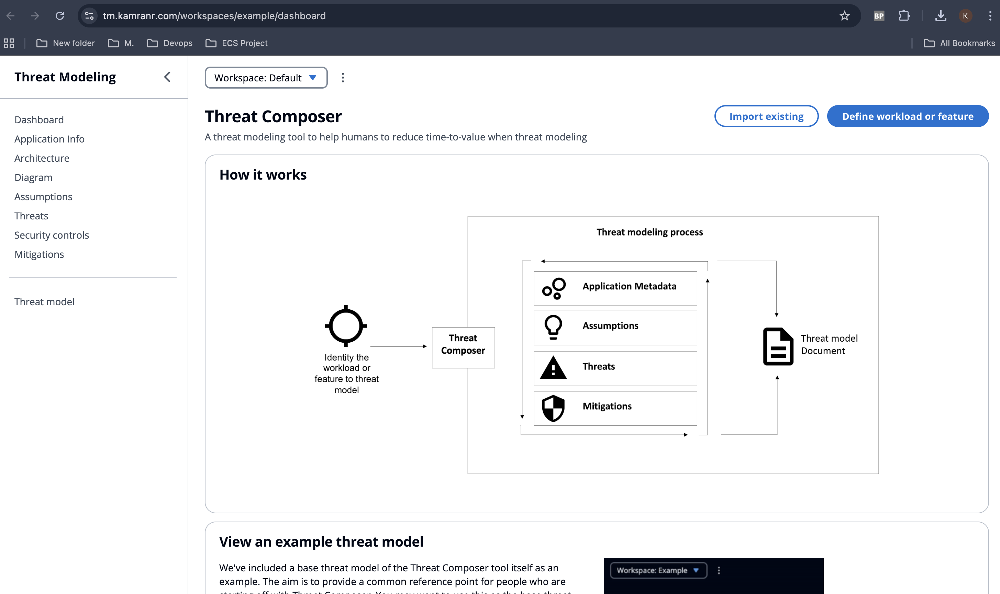
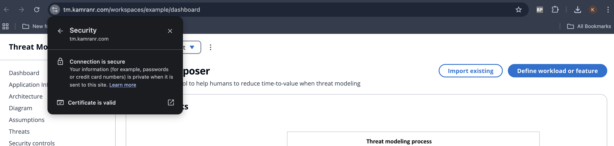
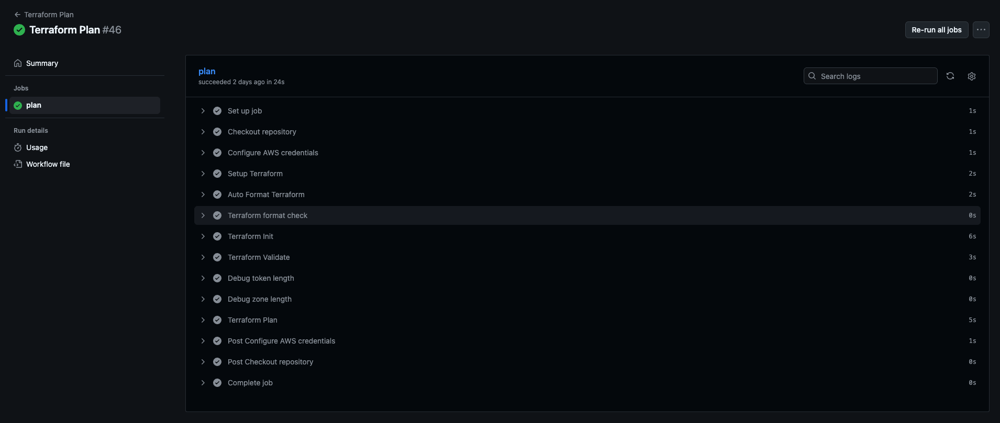
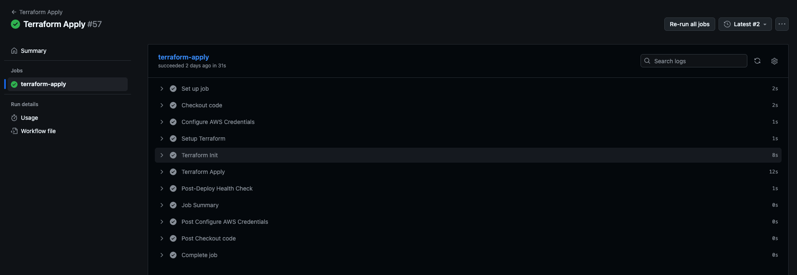
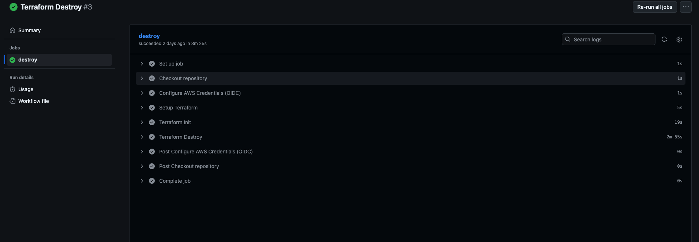

# Containerised Application Deployment on AWS ECS Fargate

This project deploys a production-ready web application (Amazon Threat-Composer App) onto AWS ECS Fargate using Terraform, with a fully automated CI/CD pipeline powered by GitHub Actions. Instead of manually assembling cloud services, everything is orchestrated through code for speed, safety, and consistency.

---

## Overview:

- Runs inside a container
- Stored in Amazon ECR
- Hosted on ECS Fargate
- Traffic routed via ALB
- Secured with HTTPS (ACM certificate)
- DNS via Cloudflare
- Deploys automatically on changes

---

## Architecture Diagram


---

## End-to-End Automation Pipeline:
Push to main
↓
Docker Build & Push To ECR
↓
Terraform Plan
↓
Terraform Apply
↓
Health Check
↓
Destroy (manual confirmation with "YES")


---
## Features:

- Zero manual provisioning (100% IaC)
- Push-to-deploy CI/CD pipeline
- Automated health checks after deployment
- Role-based access using OIDC (no static AWS keys)
- Built-in security scanning (Trivy)
- Automatic rollback if unhealthy
- One-click teardown via Terraform Destroy

---

## Project Structure
```text
./
├── .github
│   └── workflows
│       ├── apply.yml
│       ├── destroy.yml
│       ├── plan.yml
│       └── docker-build.yml
├── app
│   ├── Dockerfile
|
├── terraform
│   ├── modules
│   │   ├── acm/
│   │   ├── alb/
│   │   ├── ecs/
│   │   ├── iam_roles/
│   │   └── vpc/
│   ├── main.tf
│   ├── provider.tf
│   ├── variables.tf
│   └── outputs.tf
└── README.md
```
---

## Local app setup 💻

```bash
yarn install
yarn build
yarn global add serve
serve -s build

Then visit: 
http://localhost:3000

```
---

## CI/CD Workflow 

> Begins automatically on `git push main`

---

### 1. Docker Build & Push

- Build image
- Security scan with **Trivy**
- Tags:
  - `latest`
  - commit SHA
- Push to **Amazon ECR**

---

### 2. Terraform Plan

Triggered after Docker completes.

- Validates and lints Terraform
- Uses **OIDC** to assume AWS credentials (no static keys)
- Generates plan output

---

### 3. Terraform Apply

Creates:

- VPC & Subnets
- ECS Cluster & Service
- Application Load Balancer
- Listener + Target Group
- IAM Roles & Policies
- ACM Certificate
- Cloudflare DNS Record

Post-deploy health check:
`curl https://tm.kamranr.com/health.json`


If unhealthy → pipeline fails.  
May require rerun due to service startup latency.

---

### 4. Terraform Destroy (Manual)

- Select workflow
- Confirm with: `YES` 
- Once confirmed with YES all resources will be destroyed and cleaned up.


---

### Domain Dashboard



---

### Security Certificate 



---

### Docker Build


---

### Terraform Plan



---

### Terraform Apply



---

### Terraform Destroy



---


